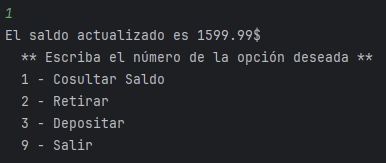
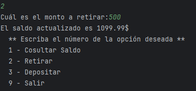
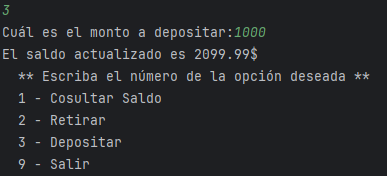

## ESTE PROGRAMA ES UN DESAFIO - BACK END - ALURA LATAM
## Nombre del Proyecto
Simulación de operaciones bancarias, esta desarrollado con Java y codificado con  IntelliJ
## Descripción
Este programa permite visualziar el saldo de una Cuenta bancaria, ademáa permite retirar y depositar dinero.
## Pantallas

## Archivos
    Desafiobancario.java prinicpal y único.
    Readme.md información de programa
## Creado por Oscar Coloma P.